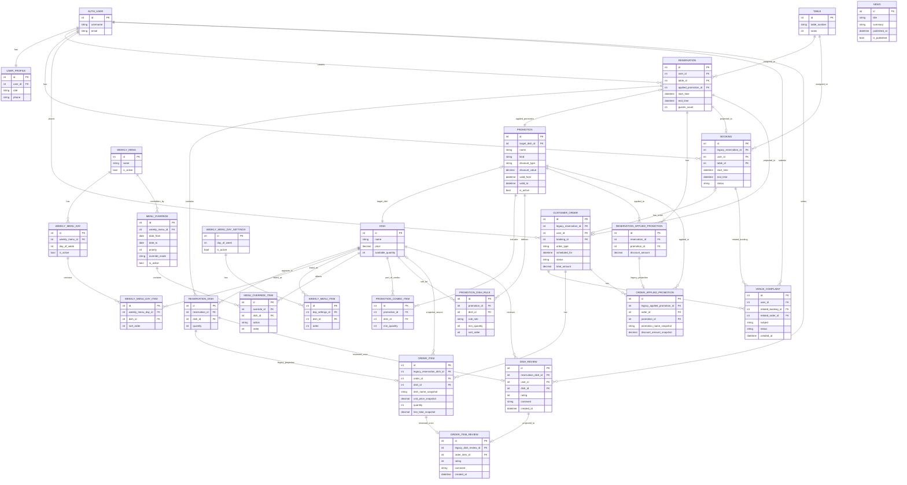

# Database ERD

```mermaid
erDiagram
    AUTH_USER ||--|| USER_PROFILE : has
    AUTH_USER ||--o{ RESERVATION : creates
    AUTH_USER ||--o{ BOOKING : has
    AUTH_USER ||--o{ CUSTOMER_ORDER : places
    AUTH_USER ||--o{ VENUE_COMPLAINT : submits
    AUTH_USER ||--o{ DISH_REVIEW : writes

    TABLE ||--o{ RESERVATION : assigned_to
    TABLE ||--o{ BOOKING : assigned_to

    RESERVATION ||--o{ RESERVATION_DISH : contains
    DISH ||--o{ RESERVATION_DISH : appears_in

    WEEKLY_MENU ||--o{ WEEKLY_MENU_DAY : has
    WEEKLY_MENU_DAY ||--o{ WEEKLY_MENU_DAY_ITEM : contains
    DISH ||--o{ WEEKLY_MENU_DAY_ITEM : listed_as

    WEEKLY_MENU_DAY_SETTINGS ||--o{ WEEKLY_MENU_ITEM : has
    DISH ||--o{ WEEKLY_MENU_ITEM : listed_as

    WEEKLY_MENU ||--o{ MENU_OVERRIDE : overridden_by
    MENU_OVERRIDE ||--o{ MENU_OVERRIDE_ITEM : contains
    DISH ||--o{ MENU_OVERRIDE_ITEM : affects

    PROMOTION o|--|| DISH : target_dish
    PROMOTION ||--o{ PROMOTION_COMBO_ITEM : includes
    PROMOTION ||--o{ PROMOTION_DISH_RULE : defines
    DISH ||--o{ PROMOTION_COMBO_ITEM : part_of_combo
    DISH ||--o{ PROMOTION_DISH_RULE : rule_for

    RESERVATION o|--|| PROMOTION : applied_promotion
    RESERVATION ||--o{ RESERVATION_APPLIED_PROMOTION : has
    PROMOTION ||--o{ RESERVATION_APPLIED_PROMOTION : applied_to

    RESERVATION ||--o| BOOKING : projected_to
    RESERVATION ||--o| CUSTOMER_ORDER : projected_to

    BOOKING o|--o| CUSTOMER_ORDER : has_order
    BOOKING ||--o{ VENUE_COMPLAINT : related_booking
    CUSTOMER_ORDER ||--o{ VENUE_COMPLAINT : related_order

    CUSTOMER_ORDER ||--o{ ORDER_ITEM : has
    DISH o|--o{ ORDER_ITEM : snapshot_source
    RESERVATION_DISH ||--o| ORDER_ITEM : legacy_projection

    CUSTOMER_ORDER ||--o{ ORDER_APPLIED_PROMOTION : has
    PROMOTION ||--o{ ORDER_APPLIED_PROMOTION : applied_to
    RESERVATION_APPLIED_PROMOTION ||--o| ORDER_APPLIED_PROMOTION : legacy_projection

    RESERVATION_DISH ||--o| DISH_REVIEW : reviewed_once
    DISH ||--o{ DISH_REVIEW : receives
    DISH_REVIEW ||--o| ORDER_ITEM_REVIEW : projected_to
    ORDER_ITEM ||--o| ORDER_ITEM_REVIEW : reviewed_once

    AUTH_USER {
      int id PK
      string username
      string email
    }
    USER_PROFILE {
      int id PK
      int user_id FK
      string role
      string phone
    }
    TABLE {
      int id PK
      string table_number
      int seats
    }
    DISH {
      int id PK
      string name
      decimal price
      int available_quantity
    }
    RESERVATION {
      int id PK
      int user_id FK
      int table_id FK
      int applied_promotion_id FK
      datetime start_time
      datetime end_time
      int guests_count
    }
    RESERVATION_DISH {
      int id PK
      int reservation_id FK
      int dish_id FK
      int quantity
    }
    WEEKLY_MENU {
      int id PK
      string name
      bool is_active
    }
    WEEKLY_MENU_DAY {
      int id PK
      int weekly_menu_id FK
      int day_of_week
      bool is_active
    }
    WEEKLY_MENU_DAY_ITEM {
      int id PK
      int weekly_menu_day_id FK
      int dish_id FK
      int sort_order
    }
    WEEKLY_MENU_DAY_SETTINGS {
      int id PK
      int day_of_week
      bool is_active
    }
    WEEKLY_MENU_ITEM {
      int id PK
      int day_settings_id FK
      int dish_id FK
      int order
    }
    MENU_OVERRIDE {
      int id PK
      int weekly_menu_id FK
      date date_from
      date date_to
      int priority
      string override_mode
      bool is_active
    }
    MENU_OVERRIDE_ITEM {
      int id PK
      int override_id FK
      int dish_id FK
      string action
      int order
    }
    NEWS {
      int id PK
      string title
      string summary
      datetime published_at
      bool is_published
    }
    BOOKING {
      int id PK
      int legacy_reservation_id FK
      int user_id FK
      int table_id FK
      datetime start_time
      datetime end_time
      string status
    }
    CUSTOMER_ORDER {
      int id PK
      int legacy_reservation_id FK
      int user_id FK
      int booking_id FK
      string order_type
      datetime scheduled_for
      string status
      decimal total_amount
    }
    VENUE_COMPLAINT {
      int id PK
      int user_id FK
      int related_booking_id FK
      int related_order_id FK
      string subject
      string status
      datetime created_at
    }
    PROMOTION {
      int id PK
      int target_dish_id FK
      string name
      string kind
      string discount_type
      decimal discount_value
      datetime valid_from
      datetime valid_to
      bool is_active
    }
    PROMOTION_COMBO_ITEM {
      int id PK
      int promotion_id FK
      int dish_id FK
      int min_quantity
    }
    PROMOTION_DISH_RULE {
      int id PK
      int promotion_id FK
      int dish_id FK
      string rule_role
      int min_quantity
      int sort_order
    }
    RESERVATION_APPLIED_PROMOTION {
      int id PK
      int reservation_id FK
      int promotion_id FK
      decimal discount_amount
    }
    ORDER_APPLIED_PROMOTION {
      int id PK
      int legacy_applied_promotion_id FK
      int order_id FK
      int promotion_id FK
      string promotion_name_snapshot
      decimal discount_amount_snapshot
    }
    ORDER_ITEM {
      int id PK
      int legacy_reservation_dish_id FK
      int order_id FK
      int dish_id FK
      string dish_name_snapshot
      decimal unit_price_snapshot
      int quantity
      decimal line_total_snapshot
    }
    DISH_REVIEW {
      int id PK
      int reservation_dish_id FK
      int user_id FK
      int dish_id FK
      int rating
      string comment
      datetime created_at
    }
    ORDER_ITEM_REVIEW {
      int id PK
      int legacy_dish_review_id FK
      int order_item_id FK
      int rating
      string comment
      datetime created_at
    }
```
